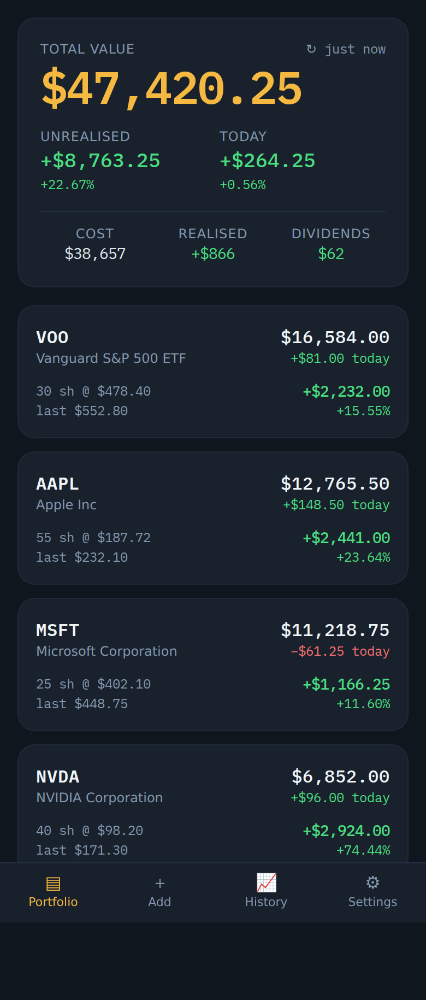
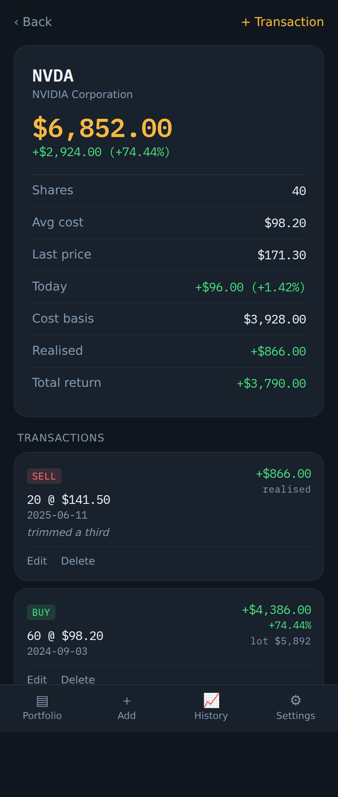
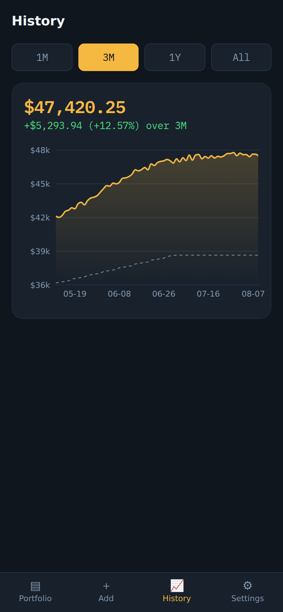
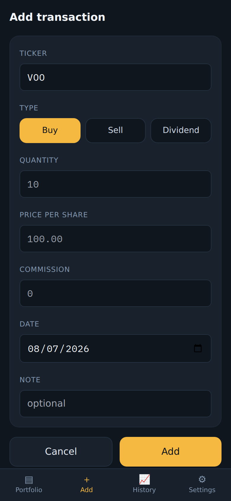
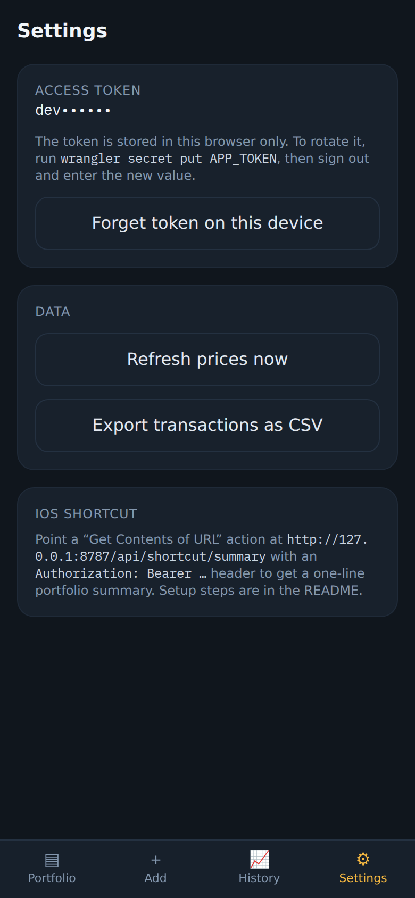

<div align="center">

# Stocker

**A self-hosted stock portfolio tracker that runs entirely on Cloudflare's free tier.**

Record every buy, sell and dividend. Stocker computes your positions, average cost basis
and profit/loss against live market prices — in a browser, or from an iOS Shortcut on your
home screen.

[](https://workers.cloudflare.com/)
[](https://developers.cloudflare.com/d1/)
[](https://react.dev/)
[](https://www.typescriptlang.org/)
[](LICENSE)





</div>

---

## Contents

- [What it does](#what-it-does)
- [Requirements](#requirements)
- [Run it locally](#run-it-locally)
- [Deploy to Cloudflare](#deploy-to-cloudflare)
- [Configuration reference](#configuration-reference)
- [Everyday commands](#everyday-commands)
- [Working with the database](#working-with-the-database)
- [API reference](#api-reference)
- [How the numbers work](#how-the-numbers-work)
- [Install on your phone](#install-on-your-phone)
- [Home screen widget](#home-screen-widget)
- [iOS Shortcut integration](#ios-shortcut-integration)
- [Security and privacy](#security-and-privacy)
- [Project layout](#project-layout)
- [Swapping the price provider](#swapping-the-price-provider)
- [Troubleshooting](#troubleshooting)
- [Not in this version](#not-in-this-version)

---

## What it does

- **Transaction-level tracking.** Buys, sells and dividends, each with price, quantity,
  commission, date and a note. Positions are derived from the log on every read, so fixing
  a five-year-old typo instantly corrects everything downstream.
- **Average-cost accounting** with realised P/L booked on each sell, dividends tracked
  separately, and a per-lot mark-to-market view on every buy.
- **Live prices** refreshed every 15 minutes during market hours by a Cron Trigger, plus a
  manual refresh whenever you want one.
- **Daily snapshots** of portfolio value, drawn as a history chart.
- **Mobile-first UI** built for a 390 px viewport, dark, with tabular monospace figures so
  numbers don't jitter as prices tick.
- **Installs as an app** on iOS and Android straight from the browser — no App Store, no
  Play Store, no build pipeline.
- **Home screen widget** for iOS via Scriptable, showing totals, your holdings and a
  portfolio-value sparkline, with a copy-paste button built into Settings.
- **iOS Shortcut endpoint** returning one line of plain text — no JSON parsing needed to
  ask Siri how you're doing.
- **One user, one token.** No accounts, no sign-up, no third party holding your positions.

### The screens

| | |
|---|---|
| **Portfolio** | Total value, unrealised P/L and day change, then your holdings — as cards or as a dense sortable table. Search by ticker or company name, filter by gainers / losers / unpriced / closed, and sort by any column. Defaults to highest value first. Pull down to refresh prices. |
| **Stock detail** | Position summary and every transaction with its own lot P/L against the live price. |
| **Add / Edit** | Ticker autocomplete, buy/sell/dividend, commission, date and note. |
| **History** | Portfolio value from daily snapshots, 1M / 3M / 1Y / All. |
| **Settings** | Manual refresh, CSV export of every transaction, and token management. |

<div align="center">


</div>

The token is requested on first load and kept in `localStorage`. If the server ever rejects
it, the app clears it and prompts again.

### Stack

| Layer | Choice |
|---|---|
| API | Cloudflare Workers (TypeScript, [Hono](https://hono.dev)) |
| Database | Cloudflare D1 (SQLite) |
| Frontend | React + Vite + Tailwind, served from Worker Assets |
| Prices | [Finnhub](https://finnhub.io) free tier, behind a swappable `PriceProvider` |
| Schedule | Cron Trigger, every 15 min during US market hours |
| Auth | One static bearer token (`APP_TOKEN`) |

Everything fits inside Cloudflare's free plan (100k Worker requests/day, 5 GB of D1) and
Finnhub's free tier (60 API calls/minute).

---

## Requirements

| | |
|---|---|
| **Node.js** | 18 or newer (`node -v`) |
| **npm** | 9 or newer — ships with Node |
| **Cloudflare account** | Free plan is enough — [sign up](https://dash.cloudflare.com/sign-up) |
| **Finnhub API key** | Free — [register here](https://finnhub.io/register). Optional for local development; without it, prices simply stay empty. |

Wrangler (Cloudflare's CLI) is installed automatically as a dev dependency — no global
install needed.

---

## Run it locally

### 1. Clone and install

```bash
git clone https://github.com/oramabo/Stocker.git
cd Stocker
npm install
```

### 2. Create your local secrets file

```bash
cp .dev.vars.example .dev.vars
```

Then edit `.dev.vars`:

```ini
APP_TOKEN=any-string-you-like-for-local-dev
FINNHUB_API_KEY=                # optional locally; leave blank to skip price fetching
```

`.dev.vars` is gitignored and never leaves your machine.

### 3. Create the local database

```bash
npm run db:migrate:local
```

This applies `db/migrations/*.sql` to a SQLite file under `.wrangler/state/` — a real local
D1, no cloud account needed yet.

### 4. Build the UI and start the Worker

```bash
npm run build      # bundles the React app into web/dist
npm run dev:api    # Worker + UI on http://localhost:8787
```

Open <http://localhost:8787>, paste the `APP_TOKEN` from `.dev.vars`, and add your first
transaction.

### Frontend hot-reload (optional)

`npm run dev:api` serves the pre-built UI, so it does not pick up frontend edits until you
rebuild. While working on the UI, run both:

```bash
npm run dev:api    # terminal 1 — Worker + API on :8787
npm run dev:web    # terminal 2 — Vite dev server on :5173
```

Use <http://localhost:5173> for instant hot-reload; Vite proxies `/api` through to the
Worker on :8787.

### Verify it works

```bash
npm test           # 60 tests: position math, API routes, price refresh
npm run typecheck  # both workspaces
```

You can also drive the API by hand:

```bash
TOKEN=$(grep APP_TOKEN .dev.vars | cut -d= -f2)

curl -X POST http://localhost:8787/api/transactions \
  -H "Authorization: Bearer $TOKEN" -H 'content-type: application/json' \
  -d '{"ticker":"AAPL","type":"buy","quantity":10,"price":100,"commission":5,"trade_date":"2024-01-02"}'

curl -H "Authorization: Bearer $TOKEN" http://localhost:8787/api/positions
```

---

## Deploy to Cloudflare

From a clean clone, start to finish:

### 1. Install and log in

```bash
npm install
npx wrangler login
```

### 2. Create the D1 database

```bash
npx wrangler d1 create stocker
```

This prints a block like:

```toml
[[d1_databases]]
binding = "DB"
database_name = "stocker"
database_id = "a1b2c3d4-5678-90ab-cdef-1234567890ab"
```

**Copy that `database_id` into `wrangler.toml`**, replacing
`REPLACE_WITH_YOUR_D1_DATABASE_ID`. A database id only exists once it has been created
against your own account, which is why it can't ship in the repo.

### 3. Apply the schema to the remote database

```bash
npm run db:migrate
```

### 4. Set your secrets

```bash
npx wrangler secret put APP_TOKEN         # paste a long random string — this is your password
npx wrangler secret put FINNHUB_API_KEY   # your key from finnhub.io
```

Generate a strong token with:

```bash
openssl rand -base64 32
```

### 5. Ship it

```bash
npm run deploy
```

This builds `web/dist` and runs `wrangler deploy`, uploading the Worker, the static assets
and the cron trigger in one go. Your app is live at:

```
https://stocker.<your-subdomain>.workers.dev
```

Open it, enter your `APP_TOKEN`, and add it to your phone's home screen.

### 6. Prime the prices

The cron only runs during market hours, so trigger the first fetch yourself — tap **Refresh
prices now** in Settings, or:

```bash
curl -X POST https://your-app.workers.dev/api/refresh -H "Authorization: Bearer $APP_TOKEN"
```

### Custom domain (optional)

Add a route to `wrangler.toml` and redeploy:

```toml
[[routes]]
pattern = "stocker.example.com"
custom_domain = true
```

The domain must be on a zone in the same Cloudflare account.

---

## Configuration reference

### Secrets

Set with `wrangler secret put <NAME>` in production, or in `.dev.vars` locally.

| Name | Required | Purpose |
|---|---|---|
| `APP_TOKEN` | **yes** | The bearer token guarding every API route. Treat it as your password. Without it the API returns 500 rather than running unauthenticated. |
| `FINNHUB_API_KEY` | for live prices | Finnhub key. Missing means refreshes are skipped with a warning and positions are carried at cost. |

### `wrangler.toml`

| Setting | Meaning |
|---|---|
| `[[d1_databases]] database_id` | Your D1 id from `wrangler d1 create` — **must be filled in before the first deploy**. |
| `[triggers] crons` | `0,15,30,45 13-21 * * 1-5` — every 15 min, Mon–Fri, 13:00–21:45 UTC. |
| `[vars] SNAPSHOT_HOUR_UTC` | The UTC hour whose :30 tick also writes the daily snapshot (default `21`, i.e. 21:30 UTC, just after the US close). |
| `[assets] run_worker_first` | Keeps `/api/*` on the Worker; every other path falls through to the built UI with SPA fallback. |

**Trading outside US hours?** Adjust the cron and `SNAPSHOT_HOUR_UTC` together — the
snapshot should land just after your market closes. Cron expressions are always UTC.

---

## Everyday commands

| Command | What it does |
|---|---|
| `npm run dev:api` | Worker + API + built UI on :8787 |
| `npm run dev:web` | Vite dev server with hot-reload on :5173 |
| `npm run build` | Build the React app into `web/dist` |
| `npm test` | Run the full test suite |
| `npm run typecheck` | Typecheck both workspaces |
| `npm run db:migrate:local` | Apply migrations to the local database |
| `npm run db:migrate` | Apply migrations to the remote database |
| `npm run deploy` | Build the UI and deploy the Worker |

---

## Working with the database

Run SQL against either database directly:

```bash
# local
npx wrangler d1 execute stocker --local --command "SELECT * FROM transactions ORDER BY trade_date DESC LIMIT 10"

# remote (careful — this is live data)
npx wrangler d1 execute stocker --remote --command "SELECT COUNT(*) FROM transactions"
```

**Back up** everything to a SQL file:

```bash
npx wrangler d1 export stocker --remote --output backup-$(date +%F).sql
```

You can also export your transactions as CSV from the Settings screen at any time.

**Start over locally** (destroys local data only):

```bash
rm -rf .wrangler/state/v3/d1 && npm run db:migrate:local
```

**Add a migration** by dropping a new numbered file into `db/migrations/`, e.g.
`0002_add_something.sql`, then run the migrate commands. Wrangler tracks which have been
applied.

---

## API reference

Every endpoint lives under `/api` and requires the bearer token:

```
Authorization: Bearer <APP_TOKEN>
```

Anything without it gets `401`. The token can also be passed as `?token=…`, which makes
widget-style GET requests easier to wire up. Errors come back as `{"error": "message"}`
with a 400, 401, 404, 422 or 500 status.

| Method | Path | Description |
|---|---|---|
| `GET` | `/api/summary` | Portfolio totals |
| `GET` | `/api/positions` | Every position |
| `GET` | `/api/positions/:ticker` | One position plus its transactions with per-lot P/L |
| `GET` | `/api/transactions?ticker=&from=&to=` | Transactions, newest first |
| `POST` | `/api/transactions` | Create a transaction |
| `PUT` | `/api/transactions/:id` | Edit a transaction |
| `DELETE` | `/api/transactions/:id` | Delete a transaction |
| `POST` | `/api/refresh` | Fetch fresh quotes now |
| `POST` | `/api/snapshot` | Write today's snapshot now |
| `GET` | `/api/history?days=90` | Snapshots for the chart |
| `GET` | `/api/stocks` | Known tickers, for autocomplete |
| `GET` | `/api/shortcut/summary` | **Plain text** one-liner for iOS Shortcuts |
| `GET` | `/api/health` | Liveness check |

### Creating a transaction

```bash
curl -X POST https://your-app.workers.dev/api/transactions \
  -H "Authorization: Bearer $APP_TOKEN" \
  -H 'content-type: application/json' \
  -d '{
    "ticker": "AAPL",
    "type": "buy",
    "quantity": 10,
    "price": 100,
    "commission": 5,
    "trade_date": "2024-01-02",
    "note": "starter position"
  }'
```

| Field | Required | Notes |
|---|---|---|
| `ticker` | yes | Uppercased and trimmed; registered automatically if new |
| `type` | yes | `buy`, `sell` or `dividend` |
| `quantity` | yes for buy/sell | Shares; fractional is fine. Ignored for dividends |
| `price` | yes | Per-share price — for a dividend, the **total amount received** |
| `commission` | no | Defaults to `0` |
| `trade_date` | no | `YYYY-MM-DD`, defaults to today, cannot be in the future |
| `note` | no | Free text, up to 500 characters |

### Example response — `GET /api/summary`

```json
{
  "total_value": 47420.25,
  "total_cost": 38657,
  "unrealized_pl": 8763.25,
  "unrealized_pl_pct": 22.6692,
  "realized_pl": 866,
  "dividend_income": 62.4,
  "day_change": 264.25,
  "day_change_pct": 0.5604,
  "updated_at": "2026-08-07T20:15:00Z"
}
```

### Example response — one position

```json
{
  "ticker": "NVDA",
  "name": "NVIDIA Corporation",
  "currency": "USD",
  "shares_held": 40,
  "avg_cost": 98.2,
  "cost_basis": 3928,
  "current_price": 171.3,
  "prev_close": 168.9,
  "market_value": 6852,
  "unrealized_pl": 2924,
  "unrealized_pl_pct": 74.4399,
  "realized_pl": 866,
  "dividend_income": 0,
  "total_return": 3790,
  "day_change": 96,
  "day_change_pct": 1.421,
  "price_updated_at": "2026-08-07T20:15:00Z"
}
```

---

## How the numbers work

Positions are computed from the transaction log on every read — nothing is cached or
denormalised.

### Average cost, not FIFO

- A **buy** adds `qty × price + commission` to the cost of the holding;
  `avg_cost = total_cost / shares_held`.
- A **sell** books `(sell price − avg_cost) × qty − commission` as realised P/L, removes
  `avg_cost × qty` from the cost, and leaves the average cost **per share** unchanged.
- Selling out completely **resets the basis**, so a later re-buy starts clean.
- A **dividend** accumulates into `dividend_income` and never touches cost basis. Record
  the total amount received in the `price` field.
- `unrealized_pl = market_value − cost_basis`
- `day_change = shares_held × (current_price − prev_close)`
- `total_return = unrealized + realized + dividends`

Worked example — buy 10 @ \$100 with \$5 commission, then sell 4 @ \$120 with \$5
commission:

| | |
|---|---|
| Shares held | 6 |
| Average cost | \$100.50 &nbsp; *(1005 ÷ 10)* |
| Realised P/L | \$73.00 &nbsp; *((120 − 100.50) × 4 − 5)* |
| Cost basis | \$603.00 |

### Per-lot P/L

The stock detail screen marks each **buy lot** to market:
`lot_pl = qty × current_price − (qty × price + commission)`. This is informational — sells
still consume from the average cost, not from specific lots.

### Ordering and validation

Transactions replay in `trade_date` order, ties broken by insertion order, so back-dated
entries land in the right place in history.

- Tickers are uppercased and trimmed, and registered automatically (name and currency
  pulled from the price provider when available).
- Dates cannot be in the future; quantity, price and commission must be ≥ 0.
- A sell that would leave you short **at any point in time** is rejected with `422` —
  including a back-dated sell, an edit that inflates an existing sell, and deleting a buy
  that later sells depend on.

```json
{ "error": "cannot sell 100 AAPL on 2024-03-01: only 6 share(s) held at that date" }
```

### Price refresh

Each cron tick fetches quotes for the tickers you currently hold, one at a time with a
~1.1 s gap, keeping any realistic portfolio inside Finnhub's 60 calls/minute free tier. A
ticker that fails is recorded and skipped — it never aborts the run. The 21:30 UTC tick
also writes that day's row into `snapshots`, which is what the History chart draws.

---

## Install on your phone

Stocker ships a web app manifest and a full icon set, so both platforms can install it as a
standalone app — its own home screen icon, no browser chrome, no store involved.

### iOS

Safari is required here. Chrome and Firefox on iOS cannot install web apps.

1. Open your deployment in **Safari** and enter your `APP_TOKEN`.
2. **Share** (□↑) → **Add to Home Screen** → **Add**.

### Android

1. Open your deployment in **Chrome** and enter your `APP_TOKEN`.
2. **⋮** menu → **Install app** (older versions say *Add to Home screen*).

Android installs it as a true PWA, so it also appears in the app drawer and the app
switcher.

> **If you installed before v1.1**, delete the old tile and re-add it. iOS caches the icon
> at install time and will keep showing the pre-icon screenshot otherwise.

---

## Home screen widget

### iOS — Scriptable

[Scriptable](https://scriptable.app) is a free app that runs JavaScript widgets. Stocker
serves a ready-made widget script at `/widget.js`.

1. Install **Scriptable** from the App Store.
2. In Stocker, go to **Settings → Copy widget script**. This copies the script with your
   deployment's URL already filled in.
3. Scriptable → **+** → paste → name the script **Stocker**.
4. Tap **▶** once. It prompts for your `APP_TOKEN` and stores it in the **iOS Keychain** —
   the token is never written into the script or sent anywhere but your own API.
5. Home screen → long-press → **+** → **Scriptable** → choose a size → **Add Widget**.
6. Long-press the new widget → **Edit Widget** → **Script: Stocker**.

| Size | Shows |
|---|---|
| Small | Total value, day change, total P/L, top 3 holdings |
| Medium | The above plus cost, dividends, realised P/L and 6 holdings |
| Large | The above plus position count and up to 12 holdings |
| Lock screen | Value and day change (rectangular accessory widget) |

Behaviour worth knowing:

- **Sparkline.** Portfolio value is drawn as a faded area chart across the bottom, using
  `/api/history`. It appears once there are two daily snapshots to draw a line between, so
  roughly two days after first deploy.
- **Stale prices are marked.** Quotes refresh only during market hours. When the last quote
  is over 30 minutes old the widget says `at close` rather than `today`, fades the red/green
  and footers with `closed · Thu 20:45`, so a frozen day-change never reads as a live one.
- **Movers mode.** Long-press → **Edit Widget** → **Parameter** → `movers` ranks holdings by
  today's biggest move in either direction instead of by position size. Leave it empty for
  size ranking. Two widgets can run the same script with different parameters.
- **Tapping a ticker** opens that stock's detail page; tapping anywhere else opens the app.
- **Refresh cadence** is iOS's decision. The script asks for 15 minutes to match the price
  cron, but the system throttles based on battery and usage.

If you copy `widget.js` from this repo rather than from the Settings button, set `BASE` at
the top of the file to your own origin first.

### Android

Android has no direct equivalent to Scriptable, so there is no drop-in script. What it does
have is the same building block: `/api/shortcut/summary` returns one line of plain text and
costs no price-provider quota.

```
Portfolio: $47,420 · +$8,763 (+22.7%) · today +$264 (+0.6%)
```

Any widget tool that can poll a URL and render the response will work. With
[KWGT](https://play.google.com/store/apps/details?id=org.kustom.widget), add a text item
whose formula fetches it:

```
$wg("https://your-app.workers.dev/api/shortcut/summary?token=YOUR_URL_ENCODED_TOKEN", text)$
```

Tasker, Automate and HTTP Shortcuts can drive the same endpoint. Two cautions:

- **URL-encode the token.** A base64 token contains `/`, `+` and `=`, which must become
  `%2F`, `%2B` and `%3D`. The `?token=` form exists precisely for tools that cannot set
  headers.
- **Prefer the `Authorization` header** wherever the tool supports it. Tokens in query
  strings have a habit of turning up in logs and screenshots.

Third-party app UIs change often, so treat the steps above as the shape of the job rather
than exact taps.

---

## iOS Shortcut integration

`/api/shortcut/summary` returns a single line of plain text, served entirely from cached
prices with no live provider call, so it comes back in milliseconds and the Shortcut needs
zero JSON parsing:

```
Portfolio: $47,420 · +$8,763 (+22.7%) · today +$264 (+0.6%)
```

### Shortcut 1 — "My Portfolio"

1. Open **Shortcuts → +** and name it **My Portfolio**.
2. Add **Get Contents of URL**:
   - **URL** — `https://your-app.workers.dev/api/shortcut/summary`
   - **Method** — `GET`
   - **Headers** — add `Authorization` with value `Bearer YOUR_APP_TOKEN`
3. Add **Show Notification** (or **Show Result**) and pass it the **Contents of URL**
   variable.
4. Tap the share icon → **Add to Home Screen** for a one-tap tile.

The same Shortcut appears on Apple Watch, and "Hey Siri, My Portfolio" will read it aloud.

### Shortcut 2 — "Log Buy"

1. New Shortcut named **Log Buy**.
2. **Ask for Input** → Text, prompt "Ticker" — rename the variable to `Ticker`.
3. **Ask for Input** → Number, prompt "Quantity" — `Qty`.
4. **Ask for Input** → Number, prompt "Price" — `Price`.
5. **Get Contents of URL**:
   - **URL** — `https://your-app.workers.dev/api/transactions`
   - **Method** — `POST`
   - **Headers** — `Authorization` = `Bearer YOUR_APP_TOKEN`
   - **Request Body** — **JSON**, with fields
     `ticker` (Text) → `Ticker`, `type` (Text) → `buy`,
     `quantity` (Number) → `Qty`, `price` (Number) → `Price`
6. **Show Notification** with the Contents of URL to confirm.

`trade_date` defaults to today when omitted, so the Shortcut never has to ask for it. Swap
`buy` for `sell` to make a matching "Log Sell" — over-selling comes back as a readable 422
message you can show straight in the notification.

---

## Security and privacy

This repository is public and contains no credentials. If you fork it, the same rules keep
it that way.

| What | Where it lives | In the repo? |
|---|---|---|
| `APP_TOKEN` | Cloudflare Secrets (`wrangler secret put`) | Never |
| `FINNHUB_API_KEY` | Cloudflare Secrets | Never |
| Local dev values | `.dev.vars` | Gitignored — `.dev.vars.example` holds placeholders only |
| Database exports | `backups/` | Gitignored — exports contain your real positions |
| Browser session | `localStorage` on your device | n/a |
| Widget token | iOS Keychain, via Scriptable | Never — `widget.js` ships a placeholder URL and no token |

A few notes:

- **`database_id` in `wrangler.toml` is not a credential.** It is an account-scoped
  identifier and useless to anyone without your Cloudflare login. It is committed so this
  repo deploys as-is; if you fork, replace it with your own from `wrangler d1 create`.
- **The app fails closed.** With no `APP_TOKEN` set, the API returns 500 rather than serving
  your portfolio unguarded. Every `/api` route requires the bearer token; there is no
  unauthenticated read path.
- **Rotating the token:** `wrangler secret put APP_TOKEN`, then **Settings → Forget token on
  this device** in each browser, and re-run the Scriptable script to re-enter it.
- **Back up before you experiment.** `wrangler d1 export` is the only copy of your data;
  D1 has no undo.

---

## Project layout

```
Stocker/
├── api/                     Cloudflare Worker
│   ├── src/
│   │   ├── index.ts         Hono app — routes, auth, error handling
│   │   ├── portfolio.ts     Position math (pure functions, no I/O)
│   │   ├── db.ts            D1 queries and position assembly
│   │   ├── validation.ts    Payload parsing and validation
│   │   ├── types.ts         Shared types
│   │   └── prices/
│   │       ├── provider.ts  PriceProvider interface
│   │       ├── finnhub.ts   Finnhub implementation
│   │       └── refresh.ts   Refresh loop, snapshots, cron handler
│   └── test/                Vitest — math, routes, refresh
├── web/                     React frontend
│   ├── public/              Served as-is: icons, manifest.json, widget.js
│   └── src/
│       ├── pages/           Dashboard, StockDetail, TransactionForm, History, Settings
│       ├── components/      Nav, TokenGate, PullToRefresh
│       └── lib/             API client, formatting, hooks
├── db/migrations/           D1 schema migrations
├── docs/screenshots/        Images used in this README
└── wrangler.toml            Worker, D1, assets and cron configuration
```

`web/public/widget.js` is the Scriptable widget, served verbatim at `/widget.js`. It is
plain JavaScript against Scriptable's API — not part of the React build — which is why it
carries its own header comment and a placeholder `BASE`.

The position math in `api/src/portfolio.ts` is deliberately pure — it takes an array of
transactions and returns numbers, with no database access — which is what makes the edge
cases (partial sells, sell-all-then-rebuy, commissions, dividends, back-dated entries)
straightforward to test.

---

## Swapping the price provider

Nothing outside `api/src/prices/` knows that Finnhub exists. To use a different source,
implement the interface and return it from `createProvider()` in `refresh.ts`:

```ts
export interface PriceProvider {
  readonly name: string;
  getQuote(ticker: string): Promise<Quote | null>;          // { ticker, price, prevClose }
  getProfile?(ticker: string): Promise<StockProfile | null>; // { name, currency }
}
```

Return `null` from `getQuote` for an unknown symbol; throw for a transport failure, and the
refresh loop will record it against that ticker and carry on.

---

## Troubleshooting

**`Couldn't find a D1 DB with the name or binding 'stocker'`**
You're running the command from outside the repo root, or `database_id` in `wrangler.toml`
is still the placeholder. Run wrangler commands from the project root.

**`Expected "assets.run_worker_first" to be of type boolean`**
You're on Wrangler 3. This project needs Wrangler 4 — run `npm install` to pick up the
pinned version rather than a globally installed older one.

**The UI loads but every request returns 401**
The token in the browser doesn't match the deployed `APP_TOKEN`. Go to **Settings →
Forget token on this device** and enter the current one.

**`server misconfigured: APP_TOKEN is not set` (500)**
The secret is missing. Run `npx wrangler secret put APP_TOKEN`, or add it to `.dev.vars`
locally. The app deliberately fails closed rather than serving your portfolio unguarded.

**Prices are all empty and positions show no gain**
Either `FINNHUB_API_KEY` isn't set, or no refresh has run yet — the cron only fires during
market hours. Hit **Refresh prices now** in Settings. A position with no quote is carried
at cost, so it reads as "no gain known" rather than a total loss.

**Company names show as “—”, and searching by name finds nothing**
A name is looked up the first time a ticker is recorded; if the provider was rate-limited at
that moment the row stays blank. Every price refresh now retries the missing ones, so they
fill in on their own within a few cron ticks. Nothing needs doing by hand.

**A ticker never gets a price**
Finnhub returns an all-zero quote for symbols it doesn't cover, which Stocker treats as "no
data" and reports under `failed` in the refresh response. Check the symbol on Finnhub —
non-US listings often need a suffix, e.g. `TSCO.L`.

**The history chart says "Not enough history yet"**
Snapshots are written once a day after the close, so the chart needs a couple of days to
have something to draw. You can seed one immediately with
`curl -X POST .../api/snapshot -H "Authorization: Bearer $APP_TOKEN"`.

**Frontend changes don't show up**
`npm run dev:api` serves the pre-built bundle. Either re-run `npm run build`, or use
`npm run dev:web` on :5173 for hot-reload.

**The widget shows “Bad token” in red**
The stored token no longer matches the deployed `APP_TOKEN`. The script clears the bad value
automatically — open it in Scriptable and tap ▶ to enter the current one.

**The widget shows “Open this script in Scriptable to add your token”**
It has never been run interactively, so there is nothing in the Keychain yet. Widgets cannot
show a prompt; run the script once inside the Scriptable app first.

**The widget numbers are stale, or the sparkline is missing**
iOS decides when widgets refresh and throttles aggressively on low battery. A missing
sparkline means fewer than two daily snapshots exist yet — it needs about two days after
first deploy. Both are expected rather than faults.

**The widget can't reach the API**
If you copied `widget.js` from the repo instead of the Settings button, `BASE` is still the
placeholder. Set it to your own origin, or re-copy via **Settings → Copy widget script**.

---

## Not in this version

Multi-user accounts, broker sync and CSV import, options and crypto, tax reporting,
streaming prices, multi-currency display with FX, FIFO/specific-lot accounting, price
alerts, and benchmark comparison.

**Stock splits** are worth calling out, because they fail quietly. There is no `split`
transaction type: after a 2-for-1 split the quote halves overnight while your share count
stays put, and the app will show a ~50% loss that never happened. The fix is manual — edit
each buy from before the split, doubling `quantity` and halving `price`. Average-cost
accounting absorbs that exactly, and every derived number corrects itself on the next read.

---

## License

[Apache 2.0](LICENSE)
